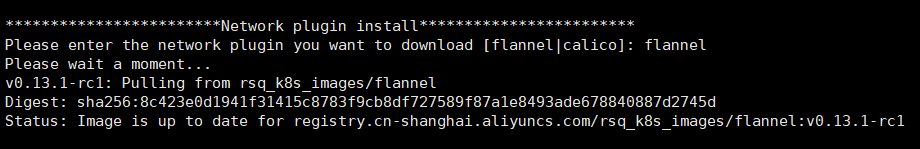

# K8s-v1.18.3 auto install in 5 min.


## 1. Git clone

```bash
git clone https://github.com/rensongqi/k8s_auto_install.git
```


## 2. Exec k8s_auto_install.sh

```
cd k8s_auto_install
sudo chmod +x k8s_auto_install.sh
./k8s_auto_install.sh
```


## 3. You need to select the type of network plug-in during installation




## 4. Docker image registry

```bash
# Contains images related to K8S, Calico & Flannel
registry.cn-shanghai.aliyuncs.com/rsq_k8s_images/
```


## 5 Node join cluster

```bash
# 1. Get token
kubeadm token list | awk 'NR==2{print $1}'

# 2. Get k8s ca hash
openssl x509 -pubkey -in /etc/kubernetes/pki/ca.crt | openssl rsa -pubin -outform der 2>/dev/null | openssl dgst -sha256 -hex | sed 's/^.* //'

# 3. Node join k8s cluster
kubeadm join 192.168.1.1:6443 --token ayhdt4.u83rp3re562iwvwu --discovery-token-ca-cert-hash sha256:1ff60a352c181ead103cb3f76fc328115bdb7e5c705d2348e8900df0ecec297e --ignore-preflight-errors=Swap
```


## 6. My blog

```
https://blog.csdn.net/Mr_rsq
```

